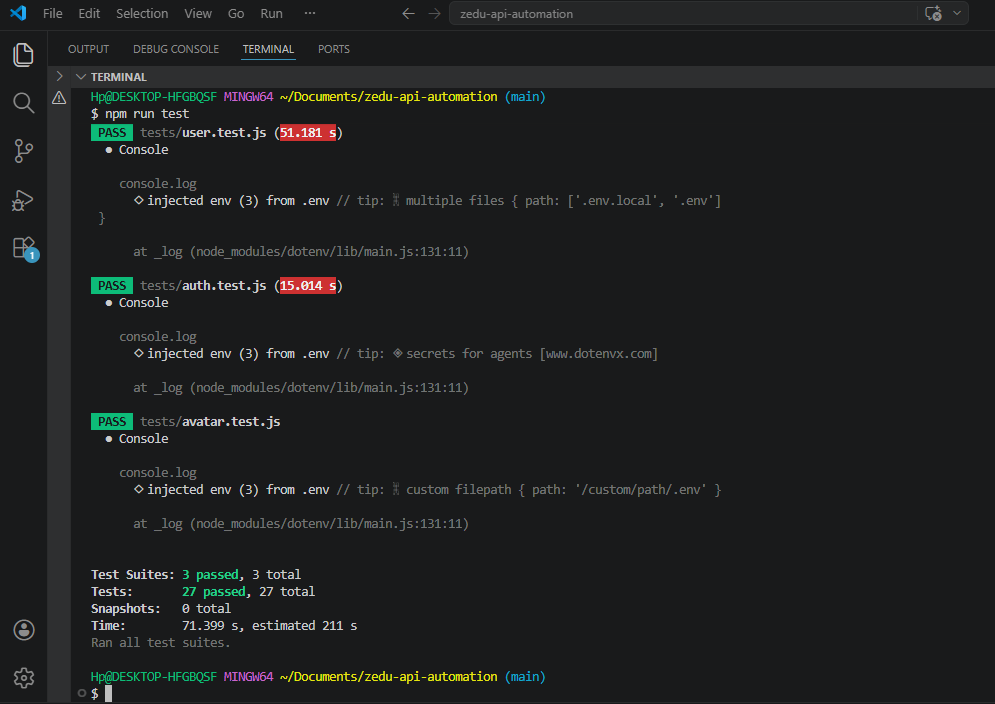

[](https://github.com/maureenobiekwe/zedu-api-automation/actions)

# Zedu API Automation

Automated API tests for the [Zedu platform](https://zedu.chat/) built with Jest, Supertest, and Zod. The whole point is that anyone can clone this, drop in a `.env` file and run the full test suite without needing to ask questions.

---

## Table of Contents

- [Setup](#setup)
  - [Quick Start (Automated)](#quick-start-automated-setup)
  - [Manual Setup](#manual-setup)
- [Environment Variables](#environment-variables)
- [Running the Tests](#running-the-tests)
- [CI/CD Pipeline](#cicd-pipeline)
- [Test Results](#test-results)
- [Demo](#demo)
- [What It Tests](#what-it-tests)
- [What Each Test Validates](#what-each-test-validates)
- [Test Summary](#test-summary)
- [Project Structure](#project-structure)
- [How Authentication Works](#how-authentication-works)
- [How Test Data Works](#how-test-data-works)
- [Code Coverage](#code-coverage)
- [Known Bugs & Findings](#known-bugs--findings)
- [Git Workflow](#git-workflow)


---

## Setup
 
## Quick Start (Automated Setup)
If you are using Mac or Linux (including Git Bash on Windows not powershell), you can clone the repository

 ```bash
git clone https://github.com/maureenobiekwe/zedu-api-automation
cd zedu-api-automation
```
You need credentials to run the tests. Run this command to create an account on the Zedu staging API (replace with your own email and password):

```bash
curl -s -X POST "https://api.staging.zedu.chat/api/v1/auth/register" \
  -H "Content-Type: application/json" \
  -d '{"email":"youremail@example.com","password":"YourPassword123","first_name":"Your","last_name":"Name","username":"yourusername"}'
```

If it returns `"User Created Successfully"`, you're good to go. Dont use special characters or emojis like `!` in the password, just stick to letters and numbers.


This process will set up the project automatically and it will add the dependencies,the .env file, creates an image to be used with hex code and run the test suites.

So if you are using Mac/Linux, use the terminal app, genrally, that is, Windows included,vscode can be used then git bash in the terminal.

Use the same email and password you just registered with and 

Run :
```bash
chmod +x setup.sh
./setup.sh <your-email> <your-password>
```


However, if you prefer the manual setup, use the instructions provided in [Manual Setup](#manual-setup) below.


## Manual Setup

### 1. Clone and install

```bash
git clone https://github.com/maureenobiekwe/zedu-api-automation
cd zedu-api-automation
npm install
```

### 2. Create your .env file

The `.env` file goes in the **root folder** (same place as package.json).

```bash
cp .env.example .env
```

Then register a test account on the staging API. Run this in your terminal (replace the email and password with your own):

```bash
curl -s -X POST "https://api.staging.zedu.chat/api/v1/auth/register" \ -H "Content-Type: application/json" -d '{
"email": "youremail@example.com",
"password": "YourPassword123", 
"first_name": "Your first name",
"last_name": "Your last Name",
"username": "yourusername"
}'
```

If it returns `"User Created Successfully"`, your account is ready. Now open `.env` and fill it in:

```
BASE_URL=https://api.staging.zedu.chat/api/v1
TEST_EMAIL=your_email@example.com
TEST_PASSWORD=YourPassword123
```

Use the same email and password you just registered with. Dont use special characters like `!` in the password, just stick to letters and numbers.

### 3. Add a test image

Drop any small `.png` image into the `utils/` folder and name it `test-image.png`. The avatar upload test will use it.

### Setup Checklist

- [ ] Cloned the repository
- [ ] Ran `npm install`
- [ ] Created `.env` file in the root folder
- [ ] Registered a test account using the curl command above
- [ ] Added TEST_EMAIL and TEST_PASSWORD to `.env`
- [ ] Added BASE_URL to `.env`
- [ ] Dropped a `test-image.png` into the `utils/` folder
- [ ] Ran `npm test` and all tests pass

[Back to top](#table-of-contents)

---

## Environment Variables

| Variable | Required | What it is |
|---|---|---|
| `BASE_URL` | Yes | API base URL, no trailing slash |
| `TEST_EMAIL` | Yes | Email of existing test account |
| `TEST_PASSWORD` | Yes | Password of existing test account |

In the CI pipeline, `BASE_URL` is set directly in the workflow file while `TEST_EMAIL` and `TEST_PASSWORD` are stored as GitHub Secrets (Settings → Secrets and variables → Actions).

[Back to top](#table-of-contents)

---

## Running the Tests

Run everything:
```bash
npm test
```

Run individual test files:
```bash
# auth tests only (register, login, security)
npm run test:auth

# user tests only (profile, search, status)
npm run test:users

# avatar tests only (upload, list, edge cases)
npm run test:avatar
```

Run with detailed output to see each test name:
```bash
npx jest --runInBand --forceExit --verbose
```

Run with coverage report:
```bash
npm test -- --coverage
```

[Back to top](#table-of-contents)

----

## CI/CD Pipeline

This project uses **GitHub Actions** for automated testing on every push and pull request to `main`.

- To make sure the the ci.yml file works well and independent of the initial coder laptop or device the repository was first created. Some checklist before creating ci.yml file was taken.

- Crosschecked that no hardcoded path in the code and the use of __dirname instead of coding a specific location on the system creating the code confirms that path hardcoding is false. This and among many other confirmation was done. also i made sure the environment base_url had a fallback, just in case the developer cloning doesnt put it in.

- Also, the jest.config file was added and script in package.json to help jest run in the ci.yml folder and produce the Junit.xml file. 

- By creating the file, everytime a code is pushed or pulled on the main or master branch. this file runs. It also makes sure that it always runs the latest code when you push codes quickly 3 consecutive times. 

- The file runs on the linux machine named ubuntu, which install all dependemcies along with the node.js. the test is run, the outcome is made to make it more visually pleasing and it is saved and the Junit XML report created can be downloaded on any device it uploads events whether the paths fail or not. the coverage file gives more indepth of the lines of codes that were actually run. so the pipeline fails successfully if it is supposed to fail and pass if its supposed to pass. no silent fail passes

- The CI configuration lives in `.github/workflows/ci.yml`. Environment variables (`TEST_EMAIL`, `TEST_PASSWORD`) are put as GitHub Secrets so no credentials are exposed in the codebase.

[Back to top](#table-of-contents)

---

## Test Results



## Demo

[Watch the full test run on Loom](https://www.loom.com/share/efc94715e9a84f3bbde15d48037e3938)

[Back to top](#table-of-contents)

---

## What It Tests

| File | What it covers | Tests |
|---|---|---|
| `tests/auth.test.js` | Registration, login, duplicate emails, missing fields, SQL injection, XSS | 13 |
| `tests/user.test.js` | Profile access, token auth, user search, status updates, SQL injection in URL | 10 |
| `tests/avatar.test.js` | Upload avatar, list avatars, upload without auth, invalid file upload | 4 |
| `tests/extra.test.js` | Channels, contact form, testimonials, connection token, org invitations, email domain validation | 11 |
| Skipped | 3 | 
| **Total** | | **38** |
No hardcoded tokens anywhere. Every token is fetched from the API at runtime.

[Back to top](#table-of-contents)

---

## What Each Test Validates

Every test goes beyond just checking the status code. Here's what gets asserted across the suite:

- **Status codes** — every test checks the HTTP status whether its 200, 201, 400, 401, 404, 422 etc
- **Field presence** — checks that the `access_token`, `user`, `message`, `status` fields are all in the server response
- **Data types** — Zod schema validation confirms the fields are strings, objects, arrays depending on the stated type for each field
- **Field values** — checks if `status` returns `"success"` or `"error"`, checks the `message` for words like "exist" using regex patterns like `/exist/i` (case-insensitive) and `/required|validation/i` (checks for either word)
- **Error messages** — negative tests verify the API returns meaningful error messages, not just status codes
- **Schema validation** — auth responses, profile responses, and error responses are all validated against defined Zod schemas in `utils/schemas.js`
- **Security checks** — SQL injection and XSS payloads are tested to make sure the server doesn't expose data or crash

[Back to top](#table-of-contents)

---

## Prerequisites

- Node.js v18 or higher
- npm v9 or higher

Check with:
```bash
node --version
npm --version
```

[Back to top](#table-of-contents)

---

## Test Summary

### auth.test.js (13 tests)

| Type | What it does |
|---|---|
| Positive | Registers a new user with valid fields. Checks 201, schema, and the status says "success" |
| Positive | Logs in with the user we just registered. Checks 200 and that access_token exists |
| Negative | Tries to register the same email again. Gets 400 with message about it already existing |
| Negative | Sends only an email, no password or name. Returns 422 |
| Negative | Logs in with the wrong password. Gets 400 and status "error" |
| Negative | Logs in with an email that was never registered. Gets 400 |
| Negative | Sends a completely empty body to register. Gets 422 |
| Negative | Sends an email without @ symbol. Gets 400 |
| Boundary | Sends a 300+ character email. Server rejects with 400 |
| Edge | Sends a 128+ character password. Server rejects it |
| Edge | Registers with special characters in username. Returns 201 |
| Security | SQL injection in the password field. Server returns 400 safely |
| Security | XSS payload in name field. **Skipped — known bug, see findings below** |

### user.test.js (10 tests)

| Type | What it does |
|---|---|
| Positive | Updates profile using form-data (multipart, not JSON). Returns 200 |
| Positive | Accesses endpoint with valid bearer token. Returns 200 |
| Positive | Searches for user by valid ID. Returns 200 with profile schema |
| Positive | Updates user status with Unicode emoji. Gets 200 |
| Negative | Accesses endpoint with no token at all. Gets blocked with 401 |
| Negative | Accesses endpoint with expired/invalid token. Gets blocked with 401 |
| Negative | Searches for user with a fake UUID. Gets 400 |
| Negative | Searches with letters instead of UUID. Gets 400 |
| Negative | Tries to update another user's status. Gets 404 |
| Edge | SQL injection string in URL path. Server returns 400 safely |

### avatar.test.js (4 tests)

| Type | What it does |
|---|---|
| Positive | Uploads avatar with valid token. Returns 200/201 |
| Positive | Lists all available avatars. Returns 200/201 |
| Negative | Uploads avatar without auth token. Gets 401 |
| Edge | Uploads a fake image (text as .png). **Skipped — known bug, see findings below** |

### extra.test.js (11 tests)

| Type | What it does |
|---|---|
| Negative | This tries to create channel without auth token. Gets 401 |
| Negative | Attempts creating channel with empty body. Gets 400 |
| Positive | Submits message in contact us section with valid data. Gets 201 |
| Negative | Attempt submitting message in contact us field with empty body. Gets 422 |
| Edge | attemps submitting message in contact section with invalid email format. Gets 422 |
| Negative | tried creating testimonial without auth token. Gets 401 |
| Negative | Createing testimonial with empty body. Gets 422 |
| Positive | should retrieves connection token with valid auth. Gets 200 with token |
| Negative | user requesting connection token without auth. Gets 401 |
| Edge | Sending invitation to users to join an organization where the sender has no/invalid organisation ID. Gets rejected |
| Security | Registers with a non-existent email domain like `@thisfakedomain123456.xyz`. API accepts it — known bug, see findings below |

[Back to top](#table-of-contents)

---

## Project Structure

```
zedu-api-automation/
├── .github/
│   └── workflows/
│       └── ci.yml               # GitHub Actions CI pipeline
├── tests/
│   ├── auth.test.js             # login, register, security tests
│   ├── user.test.js             # profile, user search, status, auth guards
│   ├── avatar.test.js           # upload image, list avatars, edge cases
│   └── extra.test.js            # channels, contact, testimonials, token, invite
├── utils/
│   ├── auth.js                  # handles all token logic, no hardcoding
│   ├── helpers.js               # faker data generation for idempotency
│   ├── schemas.js               # Zod schema definitions for response validation
│   └── test-image.png           # needed for avatar upload tests
├── test-results/
│   └── junit.xml                # generated test report (created by jest-junit)
├── .env                         # your real env/credentials (DO NOT commit)
├── .env.example                 # template showing what variables are needed
├── .gitignore
├── jest.config.js               # Jest configuration with junit reporter
├── package.json
└── README.md
```

[Back to top](#table-of-contents)

---

## How Authentication Works

`utils/auth.js` reads credentials from `.env` and calls the login endpoint to get a fresh token every time. No tokens are stored or hardcoded in the codebase. The `getAuthHeader()` function returns a ready-to-use header object that test files pass into their requests.

For the user tests, the `beforeAll` block registers a brand new user and grabs the token directly from the registration response — no separate login call needed since the API returns `access_token` on register.

## How Test Data Works

Registration tests use Faker.js to generate a new random email on every run. This means you can run the suite over and over without getting "email already exists" errors. Each test run is independent.

[Back to top](#table-of-contents)

---

## Code Coverage

Since this project tests an **external API** (the Zedu staging server), code coverage measures our utility files (`auth.js`, `helpers.js`, `schemas.js`), not the API source code itself.


The uncovered branches also known as the conditionals that weren't covered are mostly error handlers that will only be triggered when the first blocks of codes fail then the other is ran, just like an OR statement (e.g., `BASE_URL` not defined, token not found in response).

To know and view the coverage report, I suggest downloading the `coverage-report` artifact from the GitHub Actions run, extract the ZIP, and open `lcov-report/index.html` in your browser.

[Back to top](#table-of-contents)

---

## Known Bugs & Findings

These are real issues I discovered while testing the Zedu API:

**XSS payload accepted without sanitization**
The API accepts `<script>alert(document.cookie)</script>` in the `first_name` field and registers the user using the script tag as their name. Expected behavior: server should reject with 400. Actual: returns 201. This test is **skipped** and documented as a known vulnerability until the backend team fixes it.

**Server crashes on invalid file upload**
When sending text content disguised as a `.png` file, the server returns 500 instead of 400. The server doesn't validate file content, it just crashes. This test is **skipped** until the backend team adds proper file validation.

**Fake email domains accepted**
The API registers users with non-existent email domains like `@veryfakedomain.bat` without any domain validation. instead of returning 400, it returns 200. This could lead to many spam accounts being created which can not only crash the application during overlaod of requests but also it will bypass email verification. Even a bot can create an email

**Email case sensitivity**
The API lowercases emails on registration but does an exact match on login. If you register with `Test@Email.com`, you have to login with `test@email.com` or it wont work.

**Profile endpoint expects multipart/form-data**
The `/profile` PATCH endpoint rejects JSON bodies. Had to switch from `.send()` to `.field()` in Supertest. This isn't documented in the Swagger docs.

**Status update requires real Unicode emoji**
The status update endpoint needs actual emoji characters (e.g., `\u{1F680}`), not text like "rocket". Took a while to figure out.

**Endpoint paths are case-sensitive**
Used `/avatar` instead of `/avatars` and kept getting 404. Small thing but it wastes time if you dont catch it.

[Back to top](#table-of-contents)

---

## Git Workflow

**Feature branching** was used for this project, to avoid unwanted changes directly into the main branch

- Changes are made and pushed to the feature branches (e.g., `checkin/update`)
- then when a create pull request is made, the ci.yml file is triggered and if the test fails, it isnt added the the main branch
- CI runs automatically on every push to `main` and on pull requests

[Back to top](#table-of-contents)
